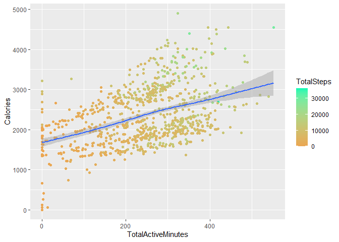

Google Data Analytics Capstone Project Bellabeat
================
2023-05-05

## Summary

**Scenario**: You are a junior data analyst working on the marketing
analyst team at Bellabeat, a high-tech manufacturer of health-focused
products for women. Bellabeat is a successful small company, but they
have the potential to become a larger player in the global smart device
market. Urška Sršen, cofounder and Chief Creative Officer of Bellabeat,
believes that analyzing smart device fitness data could help unlock new
growth opportunities for the company. You have been asked to focus on
one of Bellabeat’s products and analyze smart device data to gain
insight into how consumers are using their smart devices. The insights
you discover will then help guide marketing strategy for the company.
You will present your analysis to the Bellabeat executive team along
with your high-level recommendations for Bellabeat’s marketing strategy.

**Products**:

- Bellabeat app: Provides users with health data related to activity,
  sleep, stress, menstrual cycle, and mindfulness habits.
- Leaf: Bellabeat’s classic wellness tracker can be worn as a bracelet,
  necklace, or clip. The Leaf tracker connects to the Bellabeat app to
  track activity, sleep, and stress.
- Time: This wellness watch combines the timeless look of a classic
  timepiece with smart technology to track user activity, sleep, and
  stress. The Time watch connects to the Bellabeat app to provide you
  with insights into your daily wellness.
- Spring: This is a water bottle that tracks daily water intake using
  smart technology to ensure that you are appropriately hydrated
  throughout the day. The Spring bottle connects to the Bellabeat app to
  track your hydration levels.
- Bellabeat membership: Bellabeat also offers a subscription-based
  membership program for users. Membership gives users 24/7 access to
  fully personalized guidance on nutrition, activity, sleep, health and
  beauty, and mindfulness based on their lifestyle and goals.

**Goal of analysis**: Analyze smart device usage data to gain insight
into how people are already using their smart devices. Create high-level
recommendations for how these trends can inform Bellabeat marketing
strategy.

## Ask

**Key Stakeholders**:

- Urska Srsen - Bellabeat’s cofounder and COO
- Sando Mur - Bellabeat’s cofounder and mathemetician
- Marketing Analytics Team

**Business Task**: Create high-level recommendations for Bellabeat’s
marketing strategy based on current consumers’ usage data of
non-Bellabeat fitness devices to gain insight on how people are already
using their smart devices

## Prepare

**About the data**: The data comes from [FitBit Fitness Tracker
Data](https://www.kaggle.com/datasets/arashnic/fitbit). We know that the
data is collected over 30 days (4.13.16-5.13.16) and that there are 30
participants

- Reliable - The sample of 30 participants for this data comes from a
  distributed survey via Amazon Mechanical Turk. It is unknown whether
  there is bias in this sample of participants because we don’t know how
  the participants were chosen.
- Original - This dataset isn’t original because it gets its data from a
  distributed survey via Amazon Mechanical Turk (a third party)
- Comprehensive - The dataset includes data on sleep and activity, which
  we need insight on since those are 2 of the Time product’s uses. The
  dataset does not include data on stress, so this is important
  information we don’t have.
- Current - The data isn’t current; the data was collected in 2016 and
  doesn’t have any updated data from after 2016. Users of fitness
  devices now might be using them differently compared to 2016.
- Cited - N/A

The data files I will be using are:

- dailyActivity_merged.csv - contains a comprehensive merged version of
  the user’s activity, so we’ll use this to look at user physical
  activity
- sleepDay_merged.csv - contains information on how much the user slept
  on a given day
- weightLogInfo_merged.csv - contains user’s weight information on a
  given day

Install/load necessary packages:

``` r
# install.packages("tidyverse")
# install.packages("lubridate")
# install.packages("ggplot2")
# install.packages("here")
# install.packages("skimr")
# install.packages("janitor")
# install.packages("reshape2")
library(here)
```

    ## here() starts at C:/Users/molly/Documents/bellabeat-project

``` r
library(ggplot2)
library(tidyverse)
```

    ## ── Attaching core tidyverse packages ──────────────────────── tidyverse 2.0.0 ──
    ## ✔ dplyr     1.1.2     ✔ readr     2.1.4
    ## ✔ forcats   1.0.0     ✔ stringr   1.5.0
    ## ✔ lubridate 1.9.2     ✔ tibble    3.2.1
    ## ✔ purrr     1.0.1     ✔ tidyr     1.3.0

    ## ── Conflicts ────────────────────────────────────────── tidyverse_conflicts() ──
    ## ✖ dplyr::filter() masks stats::filter()
    ## ✖ dplyr::lag()    masks stats::lag()
    ## ℹ Use the conflicted package (<http://conflicted.r-lib.org/>) to force all conflicts to become errors

``` r
library(lubridate)
library(reshape2)
```

    ## 
    ## Attaching package: 'reshape2'
    ## 
    ## The following object is masked from 'package:tidyr':
    ## 
    ##     smiths

``` r
library(readr)
```

Store data into variables:

``` r
daily_activity <- read.csv("fitbit_data/dailyActivity_merged.csv", strip.white=TRUE)
sleep_day <- read.csv("fitbit_data/sleepDay_merged.csv", strip.white=TRUE)
weight_log <- read.csv("fitbit_data/weightLogInfo_merged.csv", strip.white=TRUE)
```

Check credibility of the data. First, check the Id columns of the tables
to verify whether there are 30 unique IDs for the 30 participants.

``` r
n_distinct(daily_activity$Id)
```

    ## [1] 33

``` r
n_distinct(sleep_day$Id)
```

    ## [1] 24

``` r
n_distinct(weight_log$Id)
```

    ## [1] 8

From this, we see that daily_activity has 33 unique Ids, sleep_day has
24, and weight_log has 8. The daily activity data has more Ids than
there should be, even without duplicate Ids, so there may have been an
error with entering in this data. Sleep and weight have less than 30
Ids, so this indicates that not all participants entered in this data.

Next, let’s check the dates of these data. I’ll check the minimum date
is 4.12.16 and maximum is 5.12.16. The date is in mdy format and is
currently stored as characters.

``` r
dates <- mdy(daily_activity$ActivityDate)
min(dates)
```

    ## [1] "2016-04-12"

``` r
max(dates)
```

    ## [1] "2016-05-12"

## Process

Check for null values:

``` r
sum(is.na(daily_activity))
```

    ## [1] 0

``` r
sum(is.na(sleep_day))
```

    ## [1] 0

``` r
sum(is.na(weight_log))
```

    ## [1] 65

Daily activity and sleep day have no null values. Weight log has 65.
When looking into the weight log data, I saw that it was only the Fat
column that showed null values; I’m likely only going to be looking at
Id, WeightPounds, BMI, or isManualReport, so I double checked for null
in those columns and found they don’t have null values.

``` r
sum(is.na(weight_log$Id))
```

    ## [1] 0

``` r
sum(is.na(weight_log$Date))
```

    ## [1] 0

``` r
sum(is.na(weight_log$WeightPounds))
```

    ## [1] 0

``` r
sum(is.na(weight_log$BMI))
```

    ## [1] 0

``` r
sum(is.na(weight_log$IsManualReport))
```

    ## [1] 0

Check formatting of dates. Dates are currently in character format for
all the data, so I used as.Date and mutate to convert the date column
from char to date.

``` r
daily_activity$ActivityDate <- format(mdy(daily_activity$ActivityDate), "%m/%d/%y")
sleep_day$SleepDay <- format(mdy_hms(sleep_day$SleepDay), "%m/%d/%y")
weight_log$Date <- format(mdy_hms(weight_log$Date), "%m/%d/%y")

daily_activity <- mutate(daily_activity, ActivityDate = as.Date(ActivityDate, format = "%m/%d/%y"))
sleep_day <- mutate(sleep_day, SleepDay = as.Date(SleepDay, format = "%m/%d/%y"))
weight_log <- mutate(weight_log, Date = as.Date(Date, format = "%m/%d/%y"))
head(daily_activity)
```

    ##           Id ActivityDate TotalSteps TotalDistance TrackerDistance
    ## 1 1503960366   2016-04-12      13162          8.50            8.50
    ## 2 1503960366   2016-04-13      10735          6.97            6.97
    ## 3 1503960366   2016-04-14      10460          6.74            6.74
    ## 4 1503960366   2016-04-15       9762          6.28            6.28
    ## 5 1503960366   2016-04-16      12669          8.16            8.16
    ## 6 1503960366   2016-04-17       9705          6.48            6.48
    ##   LoggedActivitiesDistance VeryActiveDistance ModeratelyActiveDistance
    ## 1                        0               1.88                     0.55
    ## 2                        0               1.57                     0.69
    ## 3                        0               2.44                     0.40
    ## 4                        0               2.14                     1.26
    ## 5                        0               2.71                     0.41
    ## 6                        0               3.19                     0.78
    ##   LightActiveDistance SedentaryActiveDistance VeryActiveMinutes
    ## 1                6.06                       0                25
    ## 2                4.71                       0                21
    ## 3                3.91                       0                30
    ## 4                2.83                       0                29
    ## 5                5.04                       0                36
    ## 6                2.51                       0                38
    ##   FairlyActiveMinutes LightlyActiveMinutes SedentaryMinutes Calories
    ## 1                  13                  328              728     1985
    ## 2                  19                  217              776     1797
    ## 3                  11                  181             1218     1776
    ## 4                  34                  209              726     1745
    ## 5                  10                  221              773     1863
    ## 6                  20                  164              539     1728

``` r
head(sleep_day)
```

    ##           Id   SleepDay TotalSleepRecords TotalMinutesAsleep TotalTimeInBed
    ## 1 1503960366 2016-04-12                 1                327            346
    ## 2 1503960366 2016-04-13                 2                384            407
    ## 3 1503960366 2016-04-15                 1                412            442
    ## 4 1503960366 2016-04-16                 2                340            367
    ## 5 1503960366 2016-04-17                 1                700            712
    ## 6 1503960366 2016-04-19                 1                304            320

``` r
head(weight_log)
```

    ##           Id       Date WeightKg WeightPounds Fat   BMI IsManualReport
    ## 1 1503960366 2016-05-02     52.6     115.9631  22 22.65           True
    ## 2 1503960366 2016-05-03     52.6     115.9631  NA 22.65           True
    ## 3 1927972279 2016-04-13    133.5     294.3171  NA 47.54          False
    ## 4 2873212765 2016-04-21     56.7     125.0021  NA 21.45           True
    ## 5 2873212765 2016-05-12     57.3     126.3249  NA 21.69           True
    ## 6 4319703577 2016-04-17     72.4     159.6147  25 27.45           True
    ##          LogId
    ## 1 1.462234e+12
    ## 2 1.462320e+12
    ## 3 1.460510e+12
    ## 4 1.461283e+12
    ## 5 1.463098e+12
    ## 6 1.460938e+12

I renamed the date column names in the data to be consistent with each
other.

``` r
daily_activity <- daily_activity %>% rename(Date = ActivityDate)
sleep_day <- sleep_day %>% rename(Date = SleepDay)
head(daily_activity)
```

    ##           Id       Date TotalSteps TotalDistance TrackerDistance
    ## 1 1503960366 2016-04-12      13162          8.50            8.50
    ## 2 1503960366 2016-04-13      10735          6.97            6.97
    ## 3 1503960366 2016-04-14      10460          6.74            6.74
    ## 4 1503960366 2016-04-15       9762          6.28            6.28
    ## 5 1503960366 2016-04-16      12669          8.16            8.16
    ## 6 1503960366 2016-04-17       9705          6.48            6.48
    ##   LoggedActivitiesDistance VeryActiveDistance ModeratelyActiveDistance
    ## 1                        0               1.88                     0.55
    ## 2                        0               1.57                     0.69
    ## 3                        0               2.44                     0.40
    ## 4                        0               2.14                     1.26
    ## 5                        0               2.71                     0.41
    ## 6                        0               3.19                     0.78
    ##   LightActiveDistance SedentaryActiveDistance VeryActiveMinutes
    ## 1                6.06                       0                25
    ## 2                4.71                       0                21
    ## 3                3.91                       0                30
    ## 4                2.83                       0                29
    ## 5                5.04                       0                36
    ## 6                2.51                       0                38
    ##   FairlyActiveMinutes LightlyActiveMinutes SedentaryMinutes Calories
    ## 1                  13                  328              728     1985
    ## 2                  19                  217              776     1797
    ## 3                  11                  181             1218     1776
    ## 4                  34                  209              726     1745
    ## 5                  10                  221              773     1863
    ## 6                  20                  164              539     1728

``` r
head(sleep_day)
```

    ##           Id       Date TotalSleepRecords TotalMinutesAsleep TotalTimeInBed
    ## 1 1503960366 2016-04-12                 1                327            346
    ## 2 1503960366 2016-04-13                 2                384            407
    ## 3 1503960366 2016-04-15                 1                412            442
    ## 4 1503960366 2016-04-16                 2                340            367
    ## 5 1503960366 2016-04-17                 1                700            712
    ## 6 1503960366 2016-04-19                 1                304            320

Check data in correct formats (e.g. text to numbers). I changed format
of IsManualReport in the weight log data to Boolean.

``` r
weight_log$IsManualReport <- as.logical(weight_log$IsManualReport)
head(weight_log)
```

    ##           Id       Date WeightKg WeightPounds Fat   BMI IsManualReport
    ## 1 1503960366 2016-05-02     52.6     115.9631  22 22.65           TRUE
    ## 2 1503960366 2016-05-03     52.6     115.9631  NA 22.65           TRUE
    ## 3 1927972279 2016-04-13    133.5     294.3171  NA 47.54          FALSE
    ## 4 2873212765 2016-04-21     56.7     125.0021  NA 21.45           TRUE
    ## 5 2873212765 2016-05-12     57.3     126.3249  NA 21.69           TRUE
    ## 6 4319703577 2016-04-17     72.4     159.6147  25 27.45           TRUE
    ##          LogId
    ## 1 1.462234e+12
    ## 2 1.462320e+12
    ## 3 1.460510e+12
    ## 4 1.461283e+12
    ## 5 1.463098e+12
    ## 6 1.460938e+12

Check duplicate data and remove if there’s any. Sleep day data had 3
duplicate rows which were removed.

``` r
nrow(daily_activity[duplicated(daily_activity), ])
```

    ## [1] 0

``` r
nrow(sleep_day[duplicated(sleep_day), ])
```

    ## [1] 3

``` r
nrow(weight_log[duplicated(weight_log), ])
```

    ## [1] 0

``` r
sleep_day <- distinct(sleep_day)
nrow(sleep_day[duplicated(sleep_day), ])
```

    ## [1] 0

Split users into categories of Overweight, healthy weight, underweight.
From the CDC: If your BMI is less than 18.5, it falls within the
underweight range. If your BMI is 18.5 to 24.9, it falls within the
Healthy Weight range. If your BMI is 25.0 to 29.9, it falls within the
overweight range. If your BMI is 30.0 or higher, it falls within the
obese range.

``` r
weight_log <- weight_log %>% mutate(WeightAssessment = case_when(
  BMI < 18.5 ~ 'Underweight',
  BMI >= 18.5 & BMI <= 24.9 ~ 'Healthy',
  BMI >= 25 ~ 'Overweight'
)) 
head(weight_log)
```

    ##           Id       Date WeightKg WeightPounds Fat   BMI IsManualReport
    ## 1 1503960366 2016-05-02     52.6     115.9631  22 22.65           TRUE
    ## 2 1503960366 2016-05-03     52.6     115.9631  NA 22.65           TRUE
    ## 3 1927972279 2016-04-13    133.5     294.3171  NA 47.54          FALSE
    ## 4 2873212765 2016-04-21     56.7     125.0021  NA 21.45           TRUE
    ## 5 2873212765 2016-05-12     57.3     126.3249  NA 21.69           TRUE
    ## 6 4319703577 2016-04-17     72.4     159.6147  25 27.45           TRUE
    ##          LogId WeightAssessment
    ## 1 1.462234e+12          Healthy
    ## 2 1.462320e+12          Healthy
    ## 3 1.460510e+12       Overweight
    ## 4 1.461283e+12          Healthy
    ## 5 1.463098e+12          Healthy
    ## 6 1.460938e+12       Overweight

Join together by Id and date the data from the 3 data frames.

``` r
activity_combined <- daily_activity %>% left_join(sleep_day,
                                                  by = c('Id' = 'Id', 'Date' = 'Date')) %>%
  left_join(weight_log, by = c('Id' = 'Id', 'Date' = 'Date'))
```

I’m going to add together Lightly, Fairly, Very active minutes to get
the total of active minutes.

``` r
activity_combined <- activity_combined %>%
  mutate(TotalActiveMinutes = (VeryActiveMinutes + FairlyActiveMinutes + LightlyActiveMinutes))
```

Subtract total time in bed and total minutes asleep to get total time it
takes for users to fall asleep.

``` r
activity_combined <- activity_combined %>%
  mutate(TotalFallAsleepTime = TotalTimeInBed-TotalMinutesAsleep)
```

Add a weekday column.

``` r
activity_combined$Weekday <- weekdays(activity_combined$Date)
head(activity_combined)
```

    ##           Id       Date TotalSteps TotalDistance TrackerDistance
    ## 1 1503960366 2016-04-12      13162          8.50            8.50
    ## 2 1503960366 2016-04-13      10735          6.97            6.97
    ## 3 1503960366 2016-04-14      10460          6.74            6.74
    ## 4 1503960366 2016-04-15       9762          6.28            6.28
    ## 5 1503960366 2016-04-16      12669          8.16            8.16
    ## 6 1503960366 2016-04-17       9705          6.48            6.48
    ##   LoggedActivitiesDistance VeryActiveDistance ModeratelyActiveDistance
    ## 1                        0               1.88                     0.55
    ## 2                        0               1.57                     0.69
    ## 3                        0               2.44                     0.40
    ## 4                        0               2.14                     1.26
    ## 5                        0               2.71                     0.41
    ## 6                        0               3.19                     0.78
    ##   LightActiveDistance SedentaryActiveDistance VeryActiveMinutes
    ## 1                6.06                       0                25
    ## 2                4.71                       0                21
    ## 3                3.91                       0                30
    ## 4                2.83                       0                29
    ## 5                5.04                       0                36
    ## 6                2.51                       0                38
    ##   FairlyActiveMinutes LightlyActiveMinutes SedentaryMinutes Calories
    ## 1                  13                  328              728     1985
    ## 2                  19                  217              776     1797
    ## 3                  11                  181             1218     1776
    ## 4                  34                  209              726     1745
    ## 5                  10                  221              773     1863
    ## 6                  20                  164              539     1728
    ##   TotalSleepRecords TotalMinutesAsleep TotalTimeInBed WeightKg WeightPounds Fat
    ## 1                 1                327            346       NA           NA  NA
    ## 2                 2                384            407       NA           NA  NA
    ## 3                NA                 NA             NA       NA           NA  NA
    ## 4                 1                412            442       NA           NA  NA
    ## 5                 2                340            367       NA           NA  NA
    ## 6                 1                700            712       NA           NA  NA
    ##   BMI IsManualReport LogId WeightAssessment TotalActiveMinutes
    ## 1  NA             NA    NA             <NA>                366
    ## 2  NA             NA    NA             <NA>                257
    ## 3  NA             NA    NA             <NA>                222
    ## 4  NA             NA    NA             <NA>                272
    ## 5  NA             NA    NA             <NA>                267
    ## 6  NA             NA    NA             <NA>                222
    ##   TotalFallAsleepTime   Weekday
    ## 1                  19   Tuesday
    ## 2                  23 Wednesday
    ## 3                  NA  Thursday
    ## 4                  30    Friday
    ## 5                  27  Saturday
    ## 6                  12    Sunday

Create data frame for users with weight log information.

``` r
weight_combined <- weight_log %>% left_join(sleep_day,
                                                  by = c('Id' = 'Id', 'Date' = 'Date')) %>%
  left_join(daily_activity, by = c('Id' = 'Id', 'Date' = 'Date'))
weight_combined <- weight_combined %>%
  mutate(TotalActiveMinutes = (VeryActiveMinutes + FairlyActiveMinutes + LightlyActiveMinutes))
weight_combined$Weekday <- weekdays(weight_combined$Date)
head(weight_combined)
```

    ##           Id       Date WeightKg WeightPounds Fat   BMI IsManualReport
    ## 1 1503960366 2016-05-02     52.6     115.9631  22 22.65           TRUE
    ## 2 1503960366 2016-05-03     52.6     115.9631  NA 22.65           TRUE
    ## 3 1927972279 2016-04-13    133.5     294.3171  NA 47.54          FALSE
    ## 4 2873212765 2016-04-21     56.7     125.0021  NA 21.45           TRUE
    ## 5 2873212765 2016-05-12     57.3     126.3249  NA 21.69           TRUE
    ## 6 4319703577 2016-04-17     72.4     159.6147  25 27.45           TRUE
    ##          LogId WeightAssessment TotalSleepRecords TotalMinutesAsleep
    ## 1 1.462234e+12          Healthy                 1                277
    ## 2 1.462320e+12          Healthy                 1                273
    ## 3 1.460510e+12       Overweight                 1                398
    ## 4 1.461283e+12          Healthy                NA                 NA
    ## 5 1.463098e+12          Healthy                NA                 NA
    ## 6 1.460938e+12       Overweight                NA                 NA
    ##   TotalTimeInBed TotalSteps TotalDistance TrackerDistance
    ## 1            309      14727          9.71            9.71
    ## 2            296      15103          9.66            9.66
    ## 3            422        356          0.25            0.25
    ## 4             NA       8859          5.98            5.98
    ## 5             NA       7566          5.11            5.11
    ## 6             NA         29          0.02            0.02
    ##   LoggedActivitiesDistance VeryActiveDistance ModeratelyActiveDistance
    ## 1                        0               3.21                     0.57
    ## 2                        0               3.73                     1.05
    ## 3                        0               0.00                     0.00
    ## 4                        0               0.13                     0.37
    ## 5                        0               0.00                     0.00
    ## 6                        0               0.00                     0.00
    ##   LightActiveDistance SedentaryActiveDistance VeryActiveMinutes
    ## 1                5.92                    0.00                41
    ## 2                4.88                    0.00                50
    ## 3                0.25                    0.00                 0
    ## 4                5.47                    0.01                 2
    ## 5                5.11                    0.00                 0
    ## 6                0.02                    0.00                 0
    ##   FairlyActiveMinutes LightlyActiveMinutes SedentaryMinutes Calories
    ## 1                  15                  277              798     2004
    ## 2                  24                  254              816     1990
    ## 3                   0                   32              986     2151
    ## 4                  10                  371             1057     1970
    ## 5                   0                  268              720     1431
    ## 6                   0                    3             1363     1464
    ##   TotalActiveMinutes   Weekday
    ## 1                333    Monday
    ## 2                328   Tuesday
    ## 3                 32 Wednesday
    ## 4                383  Thursday
    ## 5                268  Thursday
    ## 6                  3    Sunday

## Analysis

Summary of the data: We can see most users logged their activity levels
and sleep, but most users didn’t log their weights. From the summary,
total Steps average 7638, total active minutes average 227.5, average
time to fall asleep is 39.31 minutes, and average sedentary minutes is
991.2.

``` r
summary(activity_combined)
```

    ##        Id                 Date              TotalSteps    TotalDistance   
    ##  Min.   :1.504e+09   Min.   :2016-04-12   Min.   :    0   Min.   : 0.000  
    ##  1st Qu.:2.320e+09   1st Qu.:2016-04-19   1st Qu.: 3790   1st Qu.: 2.620  
    ##  Median :4.445e+09   Median :2016-04-26   Median : 7406   Median : 5.245  
    ##  Mean   :4.855e+09   Mean   :2016-04-26   Mean   : 7638   Mean   : 5.490  
    ##  3rd Qu.:6.962e+09   3rd Qu.:2016-05-04   3rd Qu.:10727   3rd Qu.: 7.713  
    ##  Max.   :8.878e+09   Max.   :2016-05-12   Max.   :36019   Max.   :28.030  
    ##                                                                           
    ##  TrackerDistance  LoggedActivitiesDistance VeryActiveDistance
    ##  Min.   : 0.000   Min.   :0.0000           Min.   : 0.000    
    ##  1st Qu.: 2.620   1st Qu.:0.0000           1st Qu.: 0.000    
    ##  Median : 5.245   Median :0.0000           Median : 0.210    
    ##  Mean   : 5.475   Mean   :0.1082           Mean   : 1.503    
    ##  3rd Qu.: 7.710   3rd Qu.:0.0000           3rd Qu.: 2.053    
    ##  Max.   :28.030   Max.   :4.9421           Max.   :21.920    
    ##                                                              
    ##  ModeratelyActiveDistance LightActiveDistance SedentaryActiveDistance
    ##  Min.   :0.0000           Min.   : 0.000      Min.   :0.000000       
    ##  1st Qu.:0.0000           1st Qu.: 1.945      1st Qu.:0.000000       
    ##  Median :0.2400           Median : 3.365      Median :0.000000       
    ##  Mean   :0.5675           Mean   : 3.341      Mean   :0.001606       
    ##  3rd Qu.:0.8000           3rd Qu.: 4.782      3rd Qu.:0.000000       
    ##  Max.   :6.4800           Max.   :10.710      Max.   :0.110000       
    ##                                                                      
    ##  VeryActiveMinutes FairlyActiveMinutes LightlyActiveMinutes SedentaryMinutes
    ##  Min.   :  0.00    Min.   :  0.00      Min.   :  0.0        Min.   :   0.0  
    ##  1st Qu.:  0.00    1st Qu.:  0.00      1st Qu.:127.0        1st Qu.: 729.8  
    ##  Median :  4.00    Median :  6.00      Median :199.0        Median :1057.5  
    ##  Mean   : 21.16    Mean   : 13.56      Mean   :192.8        Mean   : 991.2  
    ##  3rd Qu.: 32.00    3rd Qu.: 19.00      3rd Qu.:264.0        3rd Qu.:1229.5  
    ##  Max.   :210.00    Max.   :143.00      Max.   :518.0        Max.   :1440.0  
    ##                                                                             
    ##     Calories    TotalSleepRecords TotalMinutesAsleep TotalTimeInBed 
    ##  Min.   :   0   Min.   :1.000     Min.   : 58.0      Min.   : 61.0  
    ##  1st Qu.:1828   1st Qu.:1.000     1st Qu.:361.0      1st Qu.:403.8  
    ##  Median :2134   Median :1.000     Median :432.5      Median :463.0  
    ##  Mean   :2304   Mean   :1.119     Mean   :419.2      Mean   :458.5  
    ##  3rd Qu.:2793   3rd Qu.:1.000     3rd Qu.:490.0      3rd Qu.:526.0  
    ##  Max.   :4900   Max.   :3.000     Max.   :796.0      Max.   :961.0  
    ##                 NA's   :530       NA's   :530        NA's   :530    
    ##     WeightKg       WeightPounds        Fat             BMI       
    ##  Min.   : 52.60   Min.   :116.0   Min.   :22.00   Min.   :21.45  
    ##  1st Qu.: 61.40   1st Qu.:135.4   1st Qu.:22.75   1st Qu.:23.96  
    ##  Median : 62.50   Median :137.8   Median :23.50   Median :24.39  
    ##  Mean   : 72.04   Mean   :158.8   Mean   :23.50   Mean   :25.19  
    ##  3rd Qu.: 85.05   3rd Qu.:187.5   3rd Qu.:24.25   3rd Qu.:25.56  
    ##  Max.   :133.50   Max.   :294.3   Max.   :25.00   Max.   :47.54  
    ##  NA's   :873      NA's   :873     NA's   :938     NA's   :873    
    ##  IsManualReport      LogId           WeightAssessment   TotalActiveMinutes
    ##  Mode :logical   Min.   :1.460e+12   Length:940         Min.   :  0.0     
    ##  FALSE:26        1st Qu.:1.461e+12   Class :character   1st Qu.:146.8     
    ##  TRUE :41        Median :1.462e+12   Mode  :character   Median :247.0     
    ##  NA's :873       Mean   :1.462e+12                      Mean   :227.5     
    ##                  3rd Qu.:1.462e+12                      3rd Qu.:317.2     
    ##                  Max.   :1.463e+12                      Max.   :552.0     
    ##                  NA's   :873                                              
    ##  TotalFallAsleepTime   Weekday         
    ##  Min.   :  0.00      Length:940        
    ##  1st Qu.: 17.00      Class :character  
    ##  Median : 25.50      Mode  :character  
    ##  Mean   : 39.31                        
    ##  3rd Qu.: 40.00                        
    ##  Max.   :371.00                        
    ##  NA's   :530

``` r
# write_csv(weight_combined, file = "weightcombined.csv")
```

**Activity**

Active hours by day of week. We see that Tuesdays, Wednesdays, and
Thursdays have the most active hours recorded, while Sunday and Monday
have the least.

``` r
ggplot(data = activity_combined) + 
  geom_col(mapping = aes(x = factor(Weekday, levels = c("Saturday", "Sunday", "Monday", "Tuesday", "Wednesday", "Thursday", "Friday")), y = (TotalActiveMinutes/60))) + 
  labs(x = 'Day', y = 'Total Active Hours')
```

<!-- -->

Steps by days of the week. This graph has a similar distribution to the
one above, indicating that steps and active hours have a positive
correlation.

``` r
ggplot(data = activity_combined) + 
  geom_col(mapping = aes(x = factor(Weekday, levels = c("Saturday", "Sunday", "Monday", "Tuesday", "Wednesday", "Thursday", "Friday")), y = TotalSteps)) + 
  labs(x = 'Day', y = 'Total Steps')
```

<!-- -->

Calories by days of the week. This graph also has similar distribution
to the two above.

``` r
ggplot(data = activity_combined) + 
  geom_col(mapping = aes(x = factor(Weekday, levels = c("Saturday", "Sunday", "Monday", "Tuesday", "Wednesday", "Thursday", "Friday")), y = Calories)) + 
  labs(x = 'Day', y = 'Calories')
```

<!-- -->

Total Activity Hours logged, colored by active minutes. We can see that
the majority of time is spent in sedentary and light active minutes. The
weekdays seem to have more hours logged, indicating that users were more
active with using their fitness devices on weekdays.

``` r
dfm <- melt(activity_combined[,c('Weekday', 'VeryActiveMinutes', 'FairlyActiveMinutes', 'LightlyActiveMinutes', 'SedentaryMinutes')], id.vars = 1)

ggplot(dfm, aes(x = factor(Weekday, levels = c("Saturday", "Sunday", "Monday", "Tuesday", "Wednesday", "Thursday", "Friday")), y = value/60)) +
  geom_bar(aes(fill = variable), stat = "identity") +
  labs(x = 'Day', y = 'Total Hours')
```

<!-- -->

Let’s look at the average percentage of time spent active for the
minutes logged for each day of the week. Here we can see that Saturday
and Friday actually have the most time spent active for the minutes
logged.

``` r
activity_combined %>%
  group_by(Weekday) %>%
  summarize(per_active = TotalActiveMinutes/(TotalActiveMinutes+SedentaryMinutes)) %>%
  group_by(Weekday) %>%
  summarize(per_active = mean(per_active)) %>%
  ggplot() + 
    geom_col(mapping = aes(x = factor(Weekday, levels = c("Saturday", "Sunday", "Monday", "Tuesday", "Wednesday", "Thursday", "Friday")), y = per_active)) + 
    labs(x = 'Day', y = 'Percent of Time Active')
```

    ## Warning: Returning more (or less) than 1 row per `summarise()` group was deprecated in
    ## dplyr 1.1.0.
    ## ℹ Please use `reframe()` instead.
    ## ℹ When switching from `summarise()` to `reframe()`, remember that `reframe()`
    ##   always returns an ungrouped data frame and adjust accordingly.
    ## Call `lifecycle::last_lifecycle_warnings()` to see where this warning was
    ## generated.

    ## `summarise()` has grouped output by 'Weekday'. You can override using the
    ## `.groups` argument.

<!-- -->

Finding how many data are there for each day of the week. Tuesdays,
Wednesdays, and Thursdays have the most counts of data, while Friday,
Saturday, Sunday, Monday have less. This explains why it looks like some
of the days, e.g. Tuesday, seem to be more active days for users but
aren’t necessarily.

``` r
ggplot(data = activity_combined) + 
  geom_bar(mapping = aes(x = factor(Weekday, levels = c("Saturday", "Sunday", "Monday", "Tuesday", "Wednesday", "Thursday", "Friday")))) + 
  labs(x = 'Day')
```

<!-- -->

**Calories**

Note: the data doesn’t indicate whether Calories refers to calories
consumed or calories burned. It seems more logical that it’s calories
burned, so I’m making that assumption.

Are there relationships between activity and calories? Seems to be a
correlation between calories burned and active minutes, where more
active minutes correlates to more calories burned. Looking at the steps,
we can see that there typically seems to be more steps for more calories
burned and total active minutes. For some of the outliers we see, like
where there’s less steps but more calories burned, this could indicate
the users were very active (e.g. running) during that time, so more
calories were burnt for less steps.

``` r
ggplot(data = activity_combined) + 
  geom_point(mapping = aes(x = TotalActiveMinutes, y = Calories, color = TotalSteps)) +
  geom_smooth(method="gam", mapping = aes(x = TotalActiveMinutes, y = Calories)) +
  scale_color_gradient(low = "#eba652", high = "#05fab3")
```

    ## `geom_smooth()` using formula = 'y ~ s(x, bs = "cs")'

<!-- -->

Calories and total steps by days of the week. We can see most people are
between the ranges of 0 to 15000 steps taken and 1000 to 3000 calories
burned. According to the [NIH (National Institutes of
Health)](https://www.nih.gov/news-events/nih-research-matters/number-steps-day-more-important-step-intensity),
a goal of 10,000 steps is commonly cited but there are health benefits
even with fewer than 10,000 steps daily. Research suggests that the
total number of steps per day is more important than intensity.

``` r
ggplot(data = activity_combined) +
  geom_point(mapping = aes(x = TotalSteps, y = Calories, color = Weekday)) +
  geom_smooth(method="gam", mapping = aes(x = TotalSteps, y = Calories))
```

    ## `geom_smooth()` using formula = 'y ~ s(x, bs = "cs")'

<!-- -->

Total Distance and Calories has a similar distribution to total steps
and calories.

``` r
ggplot(data = activity_combined) +
  geom_point(mapping = aes(x = TotalDistance, y = Calories, color = Weekday)) +
  geom_smooth(method="gam", mapping = aes(x = TotalDistance, y = Calories))
```

    ## `geom_smooth()` using formula = 'y ~ s(x, bs = "cs")'

<!-- -->

**Weight**

Since there is an uneven amount of healthy and overweight user data
recorded, I’m using the averages of the data we have.

Are there relationships between activity and weight? Here we can see
that overweight and healthy weight users spent similar hours being
active. They both seem to have a more even distribution of activity
during the weekdays, with Saturday being the most active.

``` r
weight_combined %>%
  group_by(WeightAssessment, Weekday) %>%
  summarize(ActiveHours = TotalActiveMinutes/60) %>%
  group_by(WeightAssessment, Weekday) %>%
  summarize(ActiveHours = mean(ActiveHours)) %>%
  ggplot() + 
    geom_col(mapping = aes(x = WeightAssessment, y = ActiveHours, fill = factor(Weekday, levels = c("Saturday", "Sunday", "Monday", "Tuesday", "Wednesday", "Thursday", "Friday")))) + 
    labs(x = 'Weight Classification', y = 'Active Hours', fill = "Weekday")
```

    ## Warning: Returning more (or less) than 1 row per `summarise()` group was deprecated in
    ## dplyr 1.1.0.
    ## ℹ Please use `reframe()` instead.
    ## ℹ When switching from `summarise()` to `reframe()`, remember that `reframe()`
    ##   always returns an ungrouped data frame and adjust accordingly.
    ## Call `lifecycle::last_lifecycle_warnings()` to see where this warning was
    ## generated.

    ## `summarise()` has grouped output by 'WeightAssessment', 'Weekday'. You can
    ## override using the `.groups` argument.
    ## `summarise()` has grouped output by 'WeightAssessment'. You can override using
    ## the `.groups` argument.

<!-- -->

Calories and weight? We can see that despite the active hours being
similar for both healthy and overweight users, overweight users burned
more calories than healthy weight users. According to [Mayo
Clinic](https://www.mayoclinic.org/healthy-lifestyle/weight-loss/in-depth/metabolism/art-20046508#:~:text=Basal%20metabolic%20rate%20also%20depends,more%20calories%2C%20even%20at%20rest.),
larger people burn more calories even at rest, so this could be a
factor.

``` r
weight_combined %>%
  group_by(WeightAssessment, Weekday) %>%
  summarize(MeanCalories = mean(Calories)) %>%
  ggplot() + 
    geom_col(mapping = aes(x = WeightAssessment, y = MeanCalories, fill = factor(Weekday, levels = c("Saturday", "Sunday", "Monday", "Tuesday", "Wednesday", "Thursday", "Friday")))) + 
    labs(x = 'Weight Classification', y = 'Calories', fill = 'Weekday')
```

    ## `summarise()` has grouped output by 'WeightAssessment'. You can override using
    ## the `.groups` argument.

<!-- -->

Let’s look at if overweight users spend more of their active time being
very active compared to healthy weight users. From here, we can see that
the overweight users spent a lot more of their active time being very
active compared to healthy weight users.

``` r
weight_combined %>%
  group_by(WeightAssessment, Weekday) %>%
  summarize(MeanVeryActive = mean(VeryActiveMinutes/60)) %>%
  ggplot() + 
    geom_col(mapping = aes(x = WeightAssessment, y = MeanVeryActive, fill = factor(Weekday, levels = c("Saturday", "Sunday", "Monday", "Tuesday", "Wednesday", "Thursday", "Friday")))) + 
    labs(x = 'Weight Classification', y = 'Very Active Hours', fill = 'Weekday')
```

    ## `summarise()` has grouped output by 'WeightAssessment'. You can override using
    ## the `.groups` argument.

<!-- -->

Let’s now look at how many steps are taken by users of the different
weight classifications. Here we see that overweight users take more
steps than healthy weight users.

``` r
weight_combined %>%
  group_by(WeightAssessment, Weekday) %>%
  summarize(MeanTotalSteps = mean(TotalSteps)) %>%
  ggplot() + 
    geom_col(mapping = aes(x = WeightAssessment, y = MeanTotalSteps, fill = factor(Weekday, levels = c("Saturday", "Sunday", "Monday", "Tuesday", "Wednesday", "Thursday", "Friday")))) + 
    labs(x = 'Weight Classification', y = 'Total Steps', fill = 'Weekday')
```

    ## `summarise()` has grouped output by 'WeightAssessment'. You can override using
    ## the `.groups` argument.

<!-- -->

**Sleep**

Use sleep times to determine if users seem to have trouble sleeping or
spend a lot of time in bed without sleeping. According to the CDC,
adults 18-60 years need 7 or more hours of sleep per night, which would
be at least 420 minutes. We can see through the plot that there were
many instances where users do not get the recommended hours of sleep.
There are also some outliers where the amount of time spent in bed was
much more than time slept.

``` r
ggplot(data = activity_combined) +
  geom_point(mapping = aes(x = TotalMinutesAsleep, y = TotalTimeInBed)) +
  geom_smooth(method="gam", mapping = aes(x = TotalMinutesAsleep, y = TotalTimeInBed))
```

    ## `geom_smooth()` using formula = 'y ~ s(x, bs = "cs")'

    ## Warning: Removed 530 rows containing non-finite values (`stat_smooth()`).

    ## Warning: Removed 530 rows containing missing values (`geom_point()`).

<!-- -->

Could there be a correlation between sleep and activity level?

``` r
ggplot(data = activity_combined) +
  geom_point(mapping = aes(x = TotalMinutesAsleep, y = TotalActiveMinutes)) +
  geom_smooth(method="gam", mapping = aes(x = TotalMinutesAsleep, y = TotalActiveMinutes))
```

    ## `geom_smooth()` using formula = 'y ~ s(x, bs = "cs")'

    ## Warning: Removed 530 rows containing non-finite values (`stat_smooth()`).

    ## Warning: Removed 530 rows containing missing values (`geom_point()`).

<!-- -->

## Share and Act

The rest of the analysis and data visualizations are shown in the links
below:

[Kaggle dashboard
visualizations](https://public.tableau.com/app/profile/molly.taing/viz/GoogleCapstoneBellabeat/Story1?publish=yes)

[Presentation](https://docs.google.com/presentation/d/1D2DilEagkE-Snej6h521bZH5IjyfknTACcAIsQx-Jlw/edit?usp=sharing)
